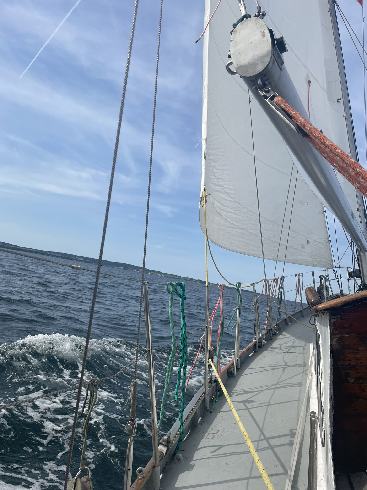
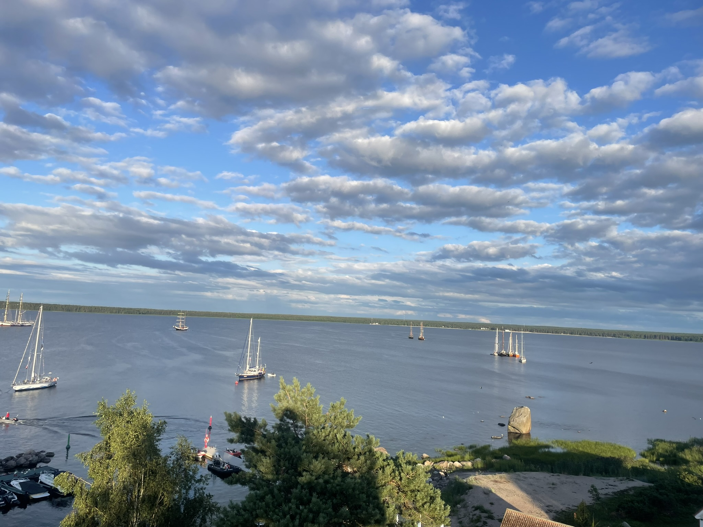
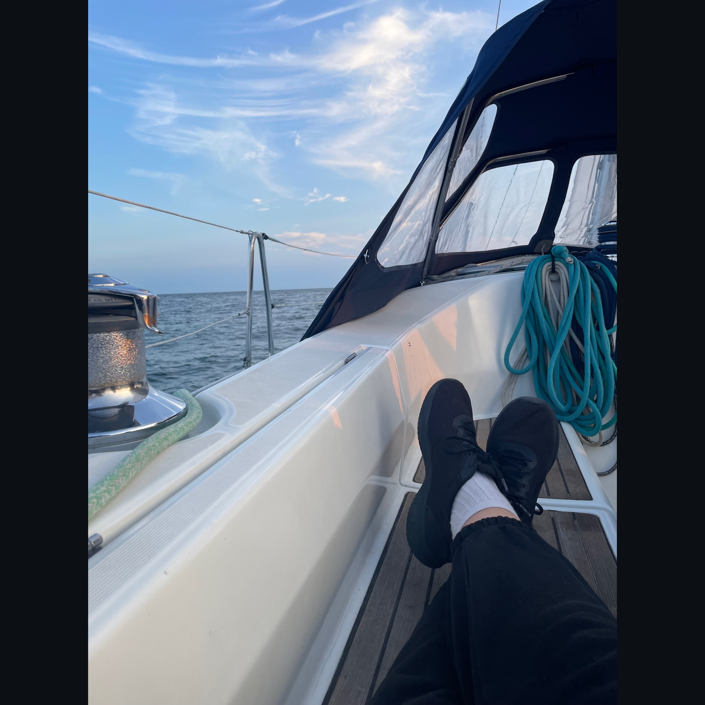

## June of 2024

### Szczecin -> Svaneke
8/10 - the weather was amazing, it was very sunny but also windy, so we were going really fast, we had some technical problems before the trip, I learned quite a lot 
### Svaneke -> Liepaja
3/10 - the first storm in my life, I thought we were going to die
### Liepaja -> Klaipeda
4/10 - very sunny but almost no wind, we barely moved
## July of 2024

### Klaipeda -> Helsinki
2/10 - the second storm in my life, this time it was very strong, last time I thought we were going to die but this time we almost died
### Helsinki -> Käsmu -> Tallinn
7/10 - even though it was rather calm I managed to learn a lot from a new person who joined our crew but she made me feel stressed 

## August of 2024

### Szczecin -> Rønne
9/10 - basically no problems, I could also practice the man-over-board maneuver, the only downside was the wind that was not so strong 
### Rønne -> Sassnitz 
10/10 - perfect speed, I almost felt like we were taking part in a race, that's how fast we were going 

# Future sailing trips

## February of 2025
### Tivat -> Kotor -> Herceg Novi 
